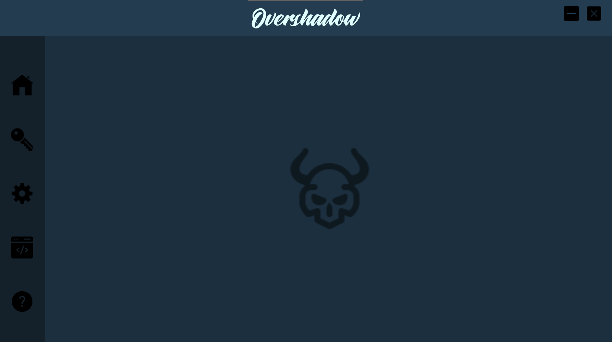

# Overshadow

Overshadow is designed to be used with a modified version of ScatterBrain which is conveniently built in. I originally found modification of ScatterBrain to be tedious and time consuming, though with Overshadow, this process is cut down significantly. 

It's worth noting that by default all of the SafetyChecks are disabled and the execution method is set to CreateRemoteThread.

This is my first attempt at making a GUI, so feel free to leave feedback on what can be improved. Enjoy!

